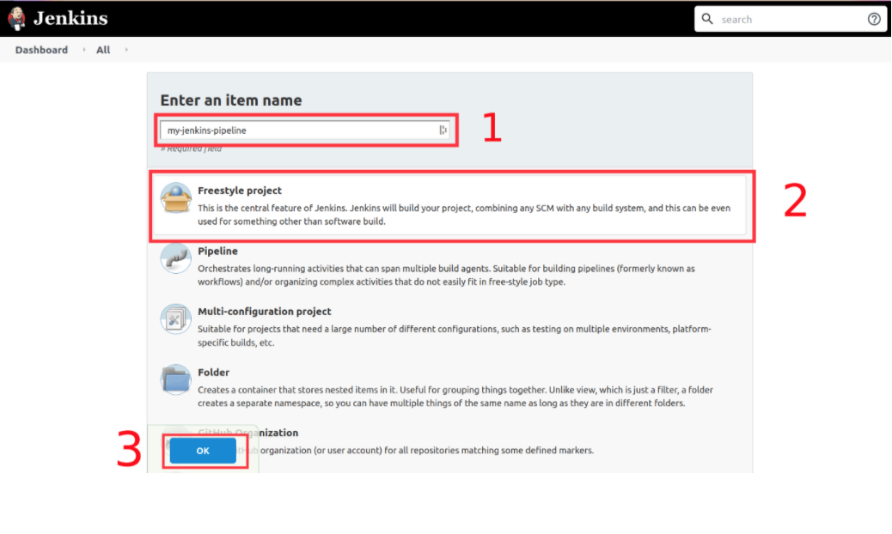

# CI-CD-Pipeline-with-Jenkins-and-GitHub


Bu yazi dizini basitce freestyle Jenkins projesi olusturmak ve deploy etmek icin bir rehber olacak.

Hayal edelim ki, yazilim takimi bir proje uzerinde yogun bir sekilde calisiyor ve yeni ozellikleri mumkun oldugu en kisa sure icerisinde sergilemeye calisiyor fakat, proje kodunu test etmek ve urunu olusturma evresi icin server'larin guncel oldugundan emin olmak, degilse guncel tutmak, ayrica hicbir seyin yanlis gitmeyeceginden emin olmak zorunda. Bunun caresi, kodu manuel bir sekilde version control'den server'lara pull etmek, test icin calistirmak ve eger her sey yolundaysa yesil bayragi dalgalandirmaktir. Fakat, bu commit siklikligi arttikca, yazilim gelistirici butun bu server guncelleme surecini tekrar tekrar yapmak zorunda.

Server'lari manuel olarak guncelleme sureci:

1. Server'in icine SSH uzaktan yonetimi kurmak.
2. Version Control System'den pull request etmek.
3. Uygulamayi baslatmadan once, konfigurasyonlari kontrol etmek,
4. Uygulamayi konteyner icinde baslatmak.
5. logs'lari kontrol etmek ve uygulamanin calistigindan emin olmak.
6. SSH seansini sonlandirmak.

### Creating Jenkins Project

Jenkins iki tur projeye sahiptir; Freestyle ve Pipeline. Ikisi arasindaki buyuk fark ise, ***pipeline projects*** belirli bir akisi takip eder ve coklu ajenda ve asamalarla insa eder, test eder ve deploy eder. ***Freestyle projects*** ise kurulum yapmak ve baslatmak acisindan kolaylik saglar. Proje konfigurasyonu ile baslayalim.

Jenkins'e giris yaptiktan sonra ([http://localhost:8080](http://localhost:8080)) asagidaki gibi ana sayfa ve kontrol paneli gorulecektir. Burada, kullanicilar, pipeline'lari olusturabilir ve ozetleri hakkinda bilgi sahibi olabilir.


Ardinda, **New Item** sekmesine tiklayip, projenin ismini yazdiktan sonra, **Freestyle project** 'i isaretliyoruz ve **OK** diyoruz.



Bir sonraki adim ise, projemizi version control system bilgisi ile konfigure etmek. Bu asamada GitHub version control system olarak kullanilacak. Bu sebepten oturu, **GitHub project**'i isaretleyelim ve proje reposunu kopyalayalim.


Daha sonra, **Source Code Management** sekmesine gelip, sorulan credential'lari dolduracagiz. Kullandiginiz VCS kullanici adi ve sifresi olmali.


 Simdi ise, **Build Trigger** sekmesine gelip tetikleyicileri set edecegiz. En cok kullanilan ve efektif yolu ise web-hooks'lari kullanmaktir. Bu sayede web tabanli web aplikasyonlari arasinda etkilesim gerceklesecek. Ancak bu projede, **Poll SCM** opsiyonunu kullanacagiz ve belirtilen programa gore surekli olarak VCS'ye query sorgulayacak. Predefined schedule ise * * * * * olacak yani, Jenkin'in her dakikada kullanacagi zamanlayici.

   

Son olarak ise, *build command* insa etme komutlarini yazacagiz. Bunu icin, **Build** sekmesine gelip *docker build and run* komutlarini *detached* modunda yazacagiz.

```shell
sudo docker image build -t react-todo:latest .

sudo docker run -d -p 3000:3000 --network host react-todo:latest
```


Projemizi olusturduk, **Save** butonuna tiklayip, acilan pencereden **Build Now** butonuna tiklayacagiz. Basarili bir sekilde konfigurasyon uapildigi takdirde, localhost:3000'de uygulama calisacaktir.
